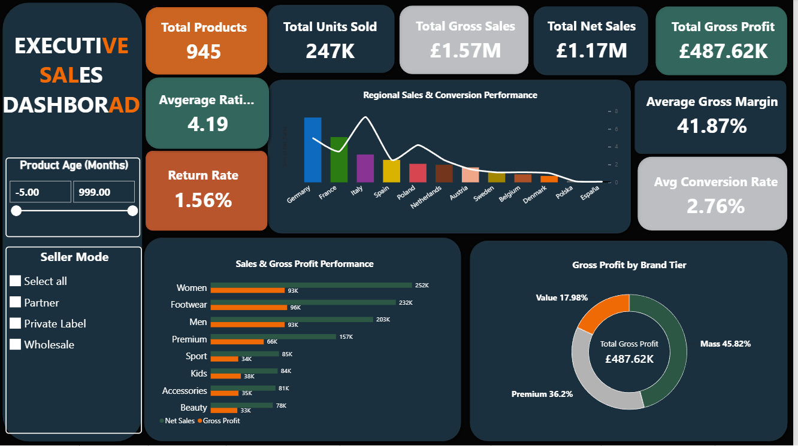
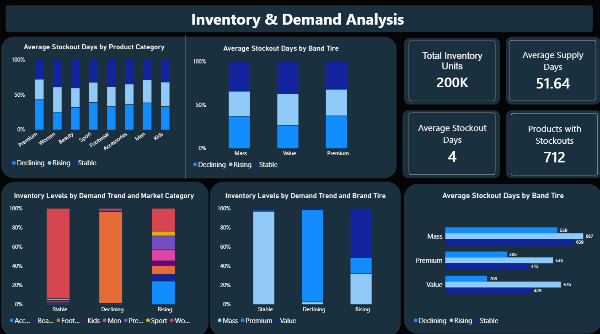
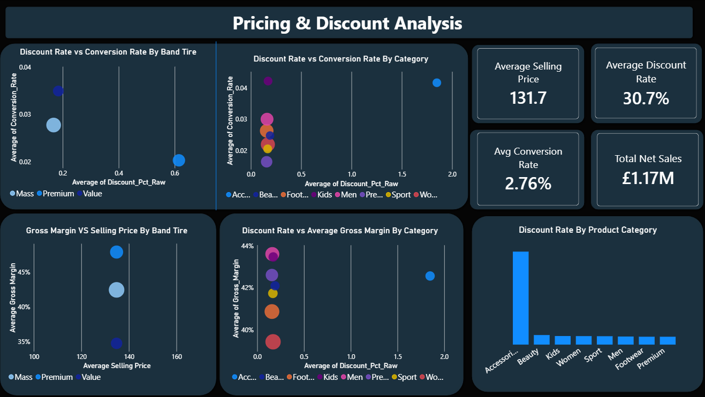
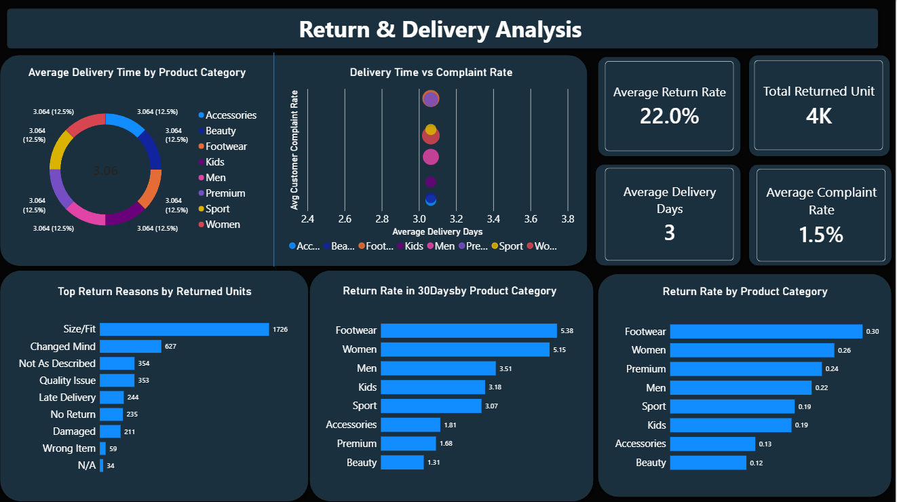

# Zalando Europe Product Performance Analysis

A Power BI analysis of product performance, pricing, demand, inventory, seller/fulfilment performance, returns and customer experience across Zalando Europe.

## 🎯 Research Questions

- How are the products performing?
- What factors are influencing performance?
- How do pricing, demand and inventory relate to performance?
- How do sellers and fulfilment models perform?
- How do returns and delivery affect customer experience?
- How can product performance be improved?

## 📊 Key Findings

- €1.17M Net Sales
- €487.62K Gross Profit
- 41.87% Average Gross Margin
- 247K Units Sold
- 22% Average Return Rate
- 48% of products have Rising Demand
- Germany contributes 27.22% of Net Sales
- Women, Footwear and Men are strong-performing categories
- Declining-demand products hold the highest inventory, indicating a demand–inventory mismatch

- ## 📌 Recommendations

Based on the analysis, the following actions are recommended to improve product performance, profitability, inventory efficiency, and customer experience:

* **Prioritize High-Performing Categories:** Maintain strong availability of Women, Footwear, and Men products while monitoring their return and complaint rates.

* **Align Inventory with Demand:** Increase stock for rising-demand products while reducing excess inventory in declining-demand products to minimize inventory risk and improve stock efficiency.

* **Optimize Pricing & Discounts:** Review discount levels across markets and categories to balance conversion, sales growth, and profit margins rather than relying heavily on discounts.

* **Strengthen Seller & Fulfilment Strategy:** Expand successful seller and fulfilment practices while reviewing weaker-performing models and applying effective approaches in lower-performing markets.

* **Reduce Returns & Customer Complaints:** Improve size and fit information, product descriptions, and product quality, particularly in categories with higher return and complaint rates such as Footwear and Women.

* **Review Older Products:** Monitor older products with declining demand and consider targeted promotions, assortment adjustments, or stock reduction to prevent prolonged inventory holding.

* **Improve Market Performance:** Investigate lower-performing markets and identify opportunities to improve sales, conversion, profitability, and product availability.

### 🎯 Expected Impact

These recommendations are intended to support better inventory allocation, healthier profit margins, improved product availability, reduced returns, and a stronger overall customer experience.

## 🛠️ Tools

- Power BI
- Excel

## 📸 Dashboard Preview

### Executive Overview

### Demand & Inventory

### Pricing & Discounts

### Returns & Delivery

## 📁 Project Files

 - [Project Presentation](./Zalando_Europe_Product_Performance_Analysis.pptx)

## 📌 Project Focus

This project evaluates product performance across key commercial and operational dimensions, including sales, profitability, pricing, demand, inventory, seller performance, fulfilment, returns, and delivery.

The analysis is designed to identify performance patterns, operational risks, and opportunities for improving product and customer outcomes.

The analysis is designed to identify performance patterns, operational risks, and opportunities for improving product and customer outcomes.

